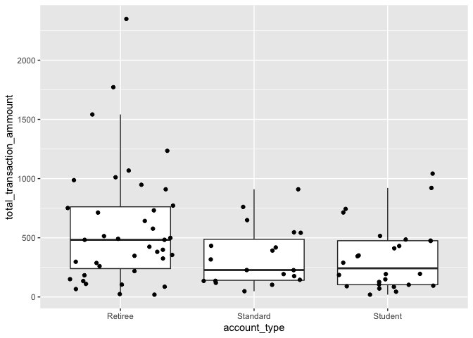
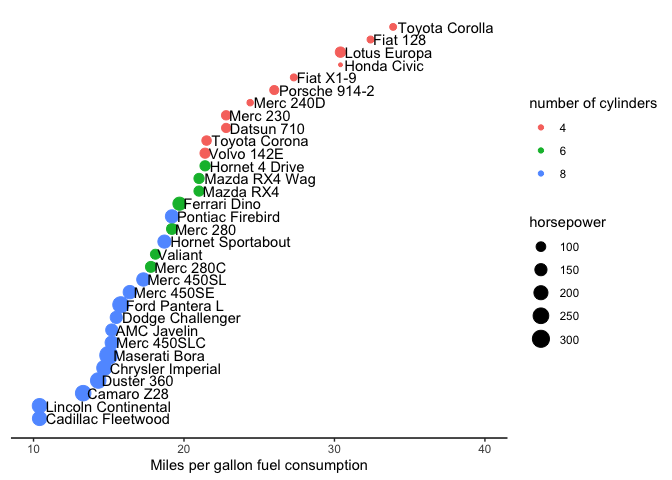

Assignment 6: Relational data plus revisiting data wrangling and
visualization
================

## **Instructions: Please read through this before you begin**

  - This assignment is due by **10pm on Monday 11/02/20.**

  - Please **reproduce this markdown template.** Pay attention to all
    the formating in this file, including bullet points, bolded
    characters, inserted code chunks, headings, text colors, blank
    lines, and etc.

  - For exercise 1 use the apppropriate `join` function to join some
    relational datasets, and use the resulting datasets to answer some
    questions.

  - Have all your code embedded within the R markdown file, and show
    both of your **code** and **plots** in the knitted markdown file.

  - Use R Markdown functionalities to **hide messages and warnings when
    needed.** (Suggesstion: messages and warnings can often be
    informative and important, so please examine them carefully and only
    turn them off when you finish the exercise).

  - Please name your R markdown file `assignment_6.Rmd` and the knitted
    markdown `assignment_6.md.` Please upload both files using your
    personal GitHub repository for this class.

  - First, load all the required packages with the following code.
    Install them if they are not installed yet.

<!-- end list -->

``` r
library(tidyverse)
library(knitr)
```

## **Exercise 1: Join functions**

**Acknowledgments:** The datasets and some of the questions for this
exercise has been borrowed (with permission) from lain Carmichael’s
course STOR 290: Introduction to Data Science.

**Read in some relational datasets from GitHub**

``` r
## for 4.1
toy1 <- read_csv('https://raw.githubusercontent.com/idc9/stor390/master/data/joins/toy_one.csv')
toy2 <- read_csv('https://raw.githubusercontent.com/idc9/stor390/master/data/joins/toy_two.csv')

## for 4.2
play1 <- read_csv('https://raw.githubusercontent.com/idc9/stor390/master/data/joins/play_one.csv')
play2 <- read_csv('https://raw.githubusercontent.com/idc9/stor390/master/data/joins/play_two.csv')

## for 4.3
banking_account_types <- read_csv('https://raw.githubusercontent.com/idc9/stor390/master/data/joins/banking_account_types.csv')
banking_transactions <- read_csv('https://raw.githubusercontent.com/idc9/stor390/master/data/joins/banking_transactions.csv')

## for 4.4
crime_arrests <- read_csv('https://raw.githubusercontent.com/idc9/stor390/master/data/joins/crime_arrests.csv')
crime_wealth <- read_csv('https://raw.githubusercontent.com/idc9/stor390/master/data/joins/crime_wealth.csv')

## for 4.5
titanic_outcomes <- read_csv('https://raw.githubusercontent.com/idc9/stor390/master/data/joins/titanic_outcomes.csv')
titanic_person_features <- read_csv('https://raw.githubusercontent.com/idc9/stor390/master/data/joins/titanic_person_features.csv')
```

**1.1 Join the `toy` datasets. Only keep rows that have matches in the
other dataset. Show the resulting dataset using `kable()`.**

``` r
toy1 %>% 
  left_join(toy2, c("key" = "label")) %>% 
  na.omit() %>% 
  kable()
```

| key | value | animal   |
| :-- | :---- | :------- |
| aaa | this  | cat      |
| aaa | this  | tiger    |
| bbb | that  | dog      |
| bbb | that  | hampster |
| ddd | thing | horse    |
| ddd | one   | horse    |

\*\*1.2. Join the `play` datasets by `key` and `label`. Keep all rows
from both datasets. Show the resulting dataset using `kable()`.

``` r
play1 %>% 
  left_join(play2, by = c("key","label")) %>% 
kable()
```

| key | label | value | othervalue |
| :-- | :---- | ----: | ---------: |
| aaa | rrr   |     1 |        111 |
| aaa | rrr   |     1 |        444 |
| rrr | aaa   |     2 |         NA |
| ttt | xxx   |     3 |        222 |
| vvv | uuu   |     4 |        333 |
| vvv | uuu   |     4 |        555 |
| rrr | aaa   |     6 |         NA |
| ttt | xxx   |     7 |        222 |
| vvv | uuu   |     8 |        333 |
| vvv | uuu   |     8 |        555 |

**1.3. Plot the distribution of total transaction amount per account ID
grouped by different account types with a boxplot shown below, using the
`banking` datasets.**

``` r
banking_account_types %>% 
  left_join(banking_transactions, c("account_id" = "id")) %>% 
  group_by(account_type, account_id) %>% 
  summarise(total_transaction_ammount = sum(transaction_amount)) %>% 
  ggplot(mapping = aes(x = account_type, y = total_transaction_ammount)) +
  geom_boxplot(outlier.shape = NA)+
  geom_jitter(height = 0)
```

<!-- -->

**1.4 Which state is in the `crime_wealth`dataset but not the
`crime_arrests` dataset? Use a join function to answer this question**

District of Columbia is in crime\_wealth dataset but not in
crime\_arrests data set.

``` r
crime_wealth %>% 
  anti_join(crime_arrests, by = "State") %>% 
  kable()
```

| Rank | State                |  2014 |  2010 |  2009 |  2007 |
| ---: | :------------------- | ----: | ----: | ----: | ----: |
|    5 | District of Columbia | 65124 | 63098 | 57214 | 52746 |

**1.5 OPTIONAL:Plot the number of passenger who did and did not survive,
grouped by their classes, using`titanic` data sets**

``` r
titanic_person_features2 <- titanic_person_features %>% 
  select(PID, PClass) 
#View(titanic_person_features2)

titanic_person_features3 <-  titanic_person_features2 %>% 
  left_join(titanic_outcomes, by = "PID") 
titanic_person_features3 $Survived<-as.factor(titanic_person_features3 $Survived)

titanic_person_features3 %>% 
group_by(PClass) %>% 
 ggplot(mapping = aes(x = PClass, fill = Survived)) +
  xlim("1st","2nd", "3rd")+
  geom_bar() 
```

<!-- -->

\#\#**Excercise 2: Fuel Efficeincy of Car Models**

This exercise uses the `mtcars` dataset. It was extracted from the 1974
Motor Trend US magazine, and comprises fuel consumption and 10 aspects
of automobile design and performance for 32 automobiles (1973-74
models).

``` r
kable(head(mtcars))
```

|                   |  mpg | cyl | disp |  hp | drat |    wt |  qsec | vs | am | gear | carb |
| :---------------- | ---: | --: | ---: | --: | ---: | ----: | ----: | -: | -: | ---: | ---: |
| Mazda RX4         | 21.0 |   6 |  160 | 110 | 3.90 | 2.620 | 16.46 |  0 |  1 |    4 |    4 |
| Mazda RX4 Wag     | 21.0 |   6 |  160 | 110 | 3.90 | 2.875 | 17.02 |  0 |  1 |    4 |    4 |
| Datsun 710        | 22.8 |   4 |  108 |  93 | 3.85 | 2.320 | 18.61 |  1 |  1 |    4 |    1 |
| Hornet 4 Drive    | 21.4 |   6 |  258 | 110 | 3.08 | 3.215 | 19.44 |  1 |  0 |    3 |    1 |
| Hornet Sportabout | 18.7 |   8 |  360 | 175 | 3.15 | 3.440 | 17.02 |  0 |  0 |    3 |    2 |
| Valiant           | 18.1 |   6 |  225 | 105 | 2.76 | 3.460 | 20.22 |  1 |  0 |    3 |    1 |

**Reproduce the following plot, which shows the miles per gallon (mpg)
of car models on the x axis (see hints below). Different models are
ordered on the y axis according to their `mpg` and their names are shown
next to the data points. Also, the size of each data point maps to its
horse power (`hp`), and the color maps to number of cylinders (`cyl`).**

``` r
mtcars1<-rownames_to_column(mtcars) 
mtcars2<-mtcars1 %>% 
  mutate(mpg_order = row_number(mtcars1$mpg)) %>% 
  select(rowname,mpg, mpg_order, cyl, hp) 
  kable(head(mtcars2))
```

| rowname           |  mpg | mpg\_order | cyl |  hp |
| :---------------- | ---: | ---------: | --: | --: |
| Mazda RX4         | 21.0 |         19 |   6 | 110 |
| Mazda RX4 Wag     | 21.0 |         20 |   6 | 110 |
| Datsun 710        | 22.8 |         24 |   4 |  93 |
| Hornet 4 Drive    | 21.4 |         21 |   6 | 110 |
| Hornet Sportabout | 18.7 |         15 |   8 | 175 |
| Valiant           | 18.1 |         14 |   6 | 105 |

``` r
mtcars2$cyl <-  as.factor(mtcars2$cyl)
```

``` r
ggplot(mtcars2, aes(x = mpg, y = mpg_order, label = rowname))+  #, color = cyl)+
   
   geom_point(aes(color = cyl, size = hp)) + geom_text(aes(label = rowname), hjust =-0.05) +
                
   xlim(10, 40)+
     
   labs(x = "Miles per gallon fuel consumption",
          color = "number of cylinders", size = "horsepower")+
    theme_classic()+
  theme(axis.line.y = element_blank(), axis.title.y = element_blank(),axis.text.y = element_blank(), axis.ticks.y = element_blank())
```

<!-- -->

**Hint1: Start by transforming the data frame into the following
format.**

  - Convert rownames to a column. (\`rownames\_to\_column() might be
    helpful)
  - create a new varible which shows the order of car models based on
    their mpg. (`row_number()`) might be helpful).

the first few rows of this new data frame might look like the following.

**Hint2: When making the plot, pay attention to the following elements
of the plot that need to be specified.**

  - Horizontal adjustment of the text labels (“hjust” option in
    `geom_text()`)

  - The range of the x-axis (`xlim()`)

  - x-axis label and legend titles (`labs()`)

  - The removal of the y-axis (`theme()`)
